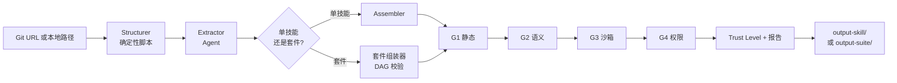

# Repo2Skill

> 将任意 GitHub 仓库自动转化为经过验证的 Agent 技能。

**Repo2Skill** 是一个遵循 Agent Skills 协议的技能包，它教会 Agent 如何解构任意 Git 仓库并输出一个符合标准的 Agent 技能（或在仓库较为复杂时，输出一个 **技能套件**）。它结合确定性脚本与 Agent 推理能力，覆盖全生命周期：分析、提取、组装、四级安全验证（G1–G4）、多维度质量评分，以及面向生态的打包。

**状态**：设计草案 · **版本**：1.0 · **日期**：2026-05-13

---

## 为什么需要 Repo2Skill

Anthropic 的 Agent Skills 协议标准化了技能封装方式（`SKILL.md` + frontmatter + 渐进式披露），但如何从开源长尾中系统地提取技能仍然是一个高人工成本、高风险的过程。Repo2Skill 自动化整条流水线，同时满足生产级技能注册中心所要求的安全与溯源保证。

核心特性：

| 特性                        | 含义                                                                                                                 |
| --------------------------- | -------------------------------------------------------------------------------------------------------------------- |
| **四元组模型**              | 每个技能被分解为 `(Conditions, Policy, Termination, Interface)` —— 显式、机器可检查、利于审计                        |
| **渐进式披露**              | Level 1 frontmatter（30–100 tokens）/ Level 2 正文（200–5,000）/ Level 3 辅助资产（无上限，按需加载）                |
| **G1–G4 验证**              | 静态扫描 → 语义审查 → 沙箱执行 → 权限比对，每一级门控输出 Trust Level L0–L4                                          |
| **技能套件（Skill Suite）** | 复杂仓库映射为一组相关技能，关系经过 DAG 校验（`depends-on` / `composes` / `bundled-with` / `requires-output-from`） |
| **注册中心就绪**            | 输出使用 kebab-case 字段的 `skill.yaml`，兼容 JFrog Artifactory、AWS Agent Registry 等目录                           |

---

## 工作原理



角色分工：

- **Structurer** —— 确定性脚本。克隆仓库、运行 `tree-sitter`、构建依赖图，输出 `analysis.json`。
- **Extractor** —— Agent。通过密集检索 + Cross-Encoder 重排识别技能边界，并按 Recurrence / Verification / Non-obviousness / Generalizability 四项准则筛选。
- **Reviewer** —— Agent。执行 G2 语义审查（幻觉、prompt 注入、元数据一致性）。
- **Assembler** —— 确定性脚本。渲染 Jinja2 模板生成最终技能目录，并触发 G1/G3/G4。

---

## 输出布局

### 单技能模式

```text
<output-skill>/
├── SKILL.md
├── skill.yaml
├── scripts/
├── references/              # Level 3 渐进式披露资产
├── templates/
└── verification/
    ├── g1_report.json
    ├── g2_report.json
    ├── g3_report.json
    ├── g4_report.json
    └── report.json          # 多维度质量汇总
```

### 套件模式（在候选数、Token 预算、入口点、依赖图或权限差异达到 [design.md §2.5](docs/design.md#25-技能套件-skill-suite) 中的阈值时触发）

```text
<output-suite>/
├── suite.yaml               # suite-id / version / source / skills[] / relations[] / trust-level
├── README.md
├── data-cleaning/           # 每个子技能本身即完整技能包
├── feature-engineering/
├── training/
├── deployment/
└── verification/
    └── suite_report.json
```

---

## 使用方式（规划中）

Repo2Skill 以 Agent Skill 形式分发，并附带一个轻量的 CLI 包装器。

**在 Agent 对话中：**

> "把 `https://github.com/psf/black` 转换成 Skill。"

Agent 加载 Repo2Skill，运行流水线，展示 1–5 个候选技能，并在组装前请求用户确认。

**在命令行中：**

```bash
repo2skill https://github.com/psf/black
repo2skill ./my-local-repo --non-interactive --skip-g3
repo2skill https://github.com/some/data-pipeline --suite
```

CLI 标志的回退行为遵循 [design.md §5.3](docs/design.md#53-异常处理与回退)。

---

## 仓库结构

```text
Repo2Skill/
├── README.md                # 本文件
├── LICENSE
├── docs/
│   ├── design.md            # 完整设计文档（v1.0）
│   └── task.md              # 5 阶段 × 42 任务的拆解与里程碑
└── reference/               # 引用论文 PDF
    ├── automating-skill-acquisition-2603.11808v2.pdf     # [1] 主要来源论文
    ├── skillfoundry-2604.03964v1.pdf                     # [3] SkillFoundry
    ├── corpus2skill-2604.14572v2.pdf                     # [4] Corpus2Skill
    └── ssl-representation-2604.24026v4.pdf               # [5] SSL Representation
```

---

## 文档

- **[docs/design.md](docs/design.md)** —— 完整设计文档（13 章，约 580 行）：核心概念、架构、执行流程、安全模型、质量评估、生态集成、技术选型、自举策略、路线图、附录、参考文献。
- **[docs/task.md](docs/task.md)** —— 5 阶段 × 42 任务，每条任务带有设计锚点、依赖、交付物与验收标准；包含里程碑 M1–M5 和风险登记册。

### 阶段概览

| 阶段 | 名称          | 退出条件                                                  |
| ---- | ------------- | --------------------------------------------------------- |
| 1    | 核心流水线    | Python 仓库 → 可读的 `SKILL.md`，端到端跑通，不含安全门控 |
| 2    | G1 + G2       | 静态扫描与语义审查接入；Trust Level L0–L2 可计算          |
| 3    | G3 + G4       | Docker 沙箱与权限比对；完整的 L0–L4 可用                  |
| 4    | 多语言 + 套件 | 支持 JS/TS、Go、Rust；复杂仓库输出协同的技能套件          |
| 5    | 自举 + 生态   | Repo2Skill 可自我生成；交付主流注册中心适配器             |

---

## 设计依据

设计建立在五篇主要参考文献之上（完整列表见 [design.md §13](docs/design.md#13-参考文献)）：

1. **Automating Skill Acquisition through Large-Scale Mining of Open-Source Agentic Repositories**（arXiv:2603.11808v2）—— 四元组模型、G1–G4、密集检索、评估指标
2. **TheoremExplainAgent**（arXiv:2502.19400）—— 多智能体角色分解
3. **SkillFoundry**（arXiv:2604.03964）—— 通过闭环 扩展/修复/合并/剪枝 演化的自进化技能库
4. **Corpus2Skill**（arXiv:2604.14572）—— 可导航的层级技能目录（验证渐进式披露设计）
5. **SSL Representation**（arXiv:2604.24026）—— 技能文本的调度–结构–逻辑三层分解

---

## 状态与路线图

本仓库目前仅包含 **设计产物**。实现工作按 [task.md](docs/task.md) 中的阶段推进。首个里程碑（M1）是一次 Python-only 的端到端冒烟运行，产出通过 lint 检查的 `<output-skill>/`。

欢迎提交 issue、PR 与对设计的反馈。

---

## 许可证

参见 [LICENSE](LICENSE)。
